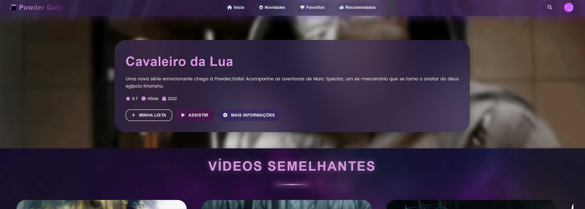

<!-- Projeto Finalizado -->
# 🎬 Powder Gate - Plataforma de Streaming Explosiva!
<p align="center">
  <!-- Contador de linguagens do GitHub -->
  
  <!-- Tamanho do repositório no GitHub -->
  
  <!-- Licença do GitHub -->
  
</p>

<div align="center">
  
</div>

## 📋 Sobre o Projeto
O Powder Gate é uma plataforma de streaming inovadora, dedicada a oferecer o melhor conteúdo de ficção científica, fantasia e suspense. Este projeto visa proporcionar uma experiência de usuário imersiva e responsiva, adaptando-se a diversos dispositivos e tamanhos de tela.

## ⚙️ Funcionalidades Principais
- **Vídeo em Destaque**: Seção principal com informações detalhadas sobre um título em destaque.
- **Carrossel de Recomendações**: Navegação intuitiva por uma seleção de vídeos semelhantes.
- **Barra de Pesquisa Interativa**: Para encontrar facilmente filmes e séries.
- **Menu de Navegação Completo**: Links para Início, Novidades, Favoritos e Recomendados.
- **Perfil de Usuário**: Acesso rápido a configurações e opções de conta.
- **Rodapé Detalhado**: Com informações de contato, links rápidos e newsletter.

## 🛠 Tecnologias Utilizadas
- **HTML5**: Para a estruturação semântica do conteúdo.
- **CSS3**: Para estilização e criação de layouts responsivos, incluindo media queries avançadas.
- **JavaScript Vanilla**: Para interatividade, manipulação do DOM, e lógica do carrossel e menu hambúrguer.
- **Font Awesome**: Biblioteca de ícones para uma interface mais rica.
- **Spline Viewer**: Para a visualização 3D interativa no fundo da página.

## 🌐 Visualize o Projeto
Você pode visualizar o projeto localmente seguindo as instruções abaixo.

## 📂 Estrutura do Projeto
```
Powder Gate/
├── assets/
│   ├── css/
│   │   └── styleMain.css
│   ├── font/
│   │   ├── Montserrat-VariableFont_wght.ttf
│   │   └── Poppins-Regular.ttf
│   ├── img/
│   ├── js/
│   │   ├── caroucel.js
│   │   └── menu.js
│   └── vid/
└── index.html
```

## 🧭 Guia de Implementação
1. **Clone ou baixe o repositório**.
2. **Navegue até a pasta `Powder Gate`**.
3. **Abra o arquivo `index.html` em seu navegador** preferido.

## 🚀 Futuras Melhorias
- [ ] **Sistema de Login e Perfis**: Implementar autenticação de usuários e perfis personalizados.
- [ ] **Funcionalidade de Favoritos/Minha Lista**: Permitir que usuários salvem seus títulos preferidos.
- [ ] **Integração com API de Conteúdo**: Conectar a plataforma a uma API para buscar dados de filmes e séries dinamicamente.
- [ ] **Otimização de Performance**: Melhorar o tempo de carregamento e a fluidez das animações.
- [ ] **Acessibilidade**: Garantir que o site seja acessível para todos os usuários, incluindo aqueles com deficiências.
- [ ] **Internacionalização**: Adicionar suporte a múltiplos idiomas.

## 💪 Como Contribuir
Contribuições são sempre bem-vindas! Se você deseja colaborar com o projeto, siga estas etapas:
1. Faça um fork do projeto.
2. Crie uma nova branch para sua feature: `git checkout -b feature/sua-feature`.
3. Commit suas mudanças: `git commit -m 'Adiciona nova feature'`.
4. Envie para a branch: `git push origin feature/sua-feature`.
5. Abra um Pull Request detalhando suas alterações.

## 📝 Nota
Este projeto foi desenvolvido com foco em responsividade e experiência do usuário, utilizando boas práticas de desenvolvimento web.

<br>

---

<p align="center">
  Desenvolvido com ☕ por <a href="https://github.com/seuUsuario">Ricardo Andreotti Gonçalves</a> 🧑‍💻
</p>
